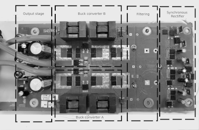
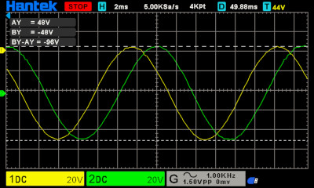
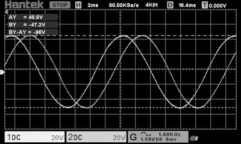
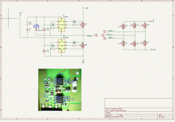
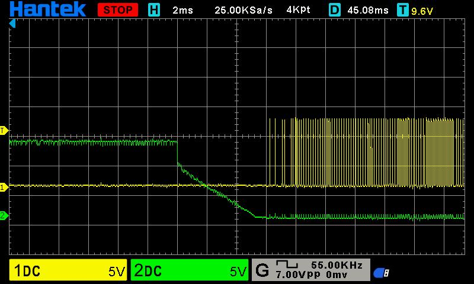
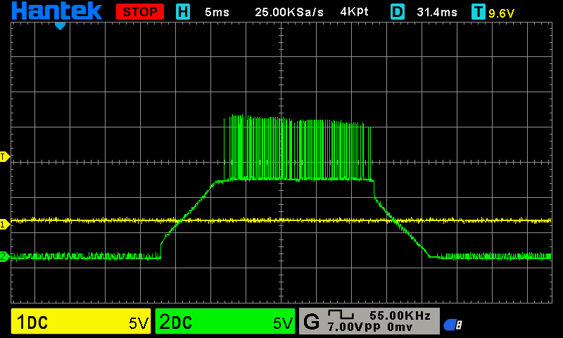
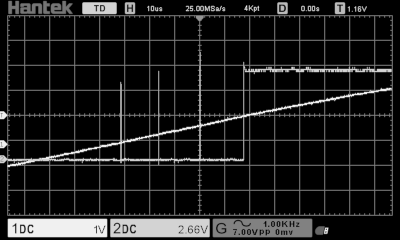
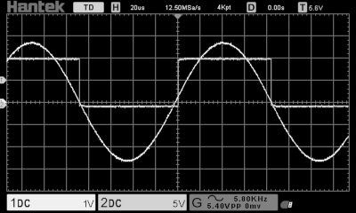
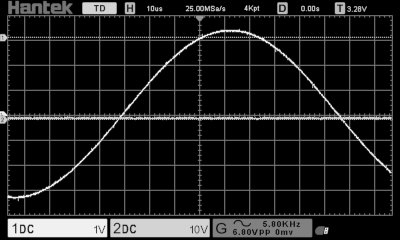

# Switching Transients in a Synchronous Rectifier  
## Watt&Sea 600 W Hydrogenerator

**Matthew Quirke — 2025**

---

## Overview

This investigation examines abnormal operation of a 12 V marine DC hydrogenerator system (Watt&Sea 600 W) and identifies the root cause within the synchronous rectifier stage.

The system consists of:
- 3-phase permanent magnet generator (Y-connected)
- Synchronous rectifier front-end
- Downstream DC-DC conversion stage

*Figure 1 – High-level system block diagram (generator → rectifier → DC-DC stage)*

The generator exhibited:
- Excessive vibration under load
- Poor electrical performance
- No faults reported via onboard diagnostics

---

## Initial Mechanical and Electrical Validation

The generator was first assessed for mechanical faults:
- Bearings
- Water ingress
- Oil loss
- Corrosion
- Rotor magnet integrity

No issues were identified.

Electrical validation included:
- Shorting generator phases and rotating manually to check symmetry
- Driving the generator with a drill
- Monitoring charge controller status
- Reviewing onboard diagnostics

No faults were reported.

---

## Isolation of Fault Domain

The generator phases were disconnected from the controller and tested into purely resistive loads.

Observations:
- Smooth operation
- No abnormal vibration
- Clean sinusoidal waveforms across all phases
- Consistent voltage vs RPM behaviour

*Figure 3 – Clean sinusoidal phase voltage under resistive load (no controller connected)*

Oscilloscope measurements confirmed:
- No winding faults
- No phase imbalance
- No magnetic or mechanical issues

👉 This isolated the fault to the charge controller.

---

## Reverse Engineering

The controller was reverse engineered:
- Block diagram created
- Focus placed on synchronous rectifier stage

*Figure 4 – Reverse engineered synchronous rectifier stage (MOSFETs + driver IC)*

Component identification (despite removed markings):
- MOSFETs: FDMS86322
- Gate drivers: IR1167B

Findings:
- One high-side MOSFET failed open
- Corresponding driver IC also faulty

This suggested:
- Driver failure → improper switching → MOSFET overstress

---

## Synchronous Rectifier Test Setup

The rectifier stage was isolated and tested independently:
- Each phase driven individually
- Range of frequencies and voltages applied
- VDS conditions varied (including low voltage operation)

This allowed direct observation of switching behaviour.

*Figure 5 – Isolated synchronous rectifier test configuration*

---

## Driver IC Investigation

### IR1167 Behaviour

Initial system used IR1167 devices.

Observed behaviour:
- Severe hard switching
- Large gate oscillations
- High transient energy
- Eventual MOSFET failure

After suspecting layout and parasitics, the driver ICs were removed and tested independently.

### Bench Testing

New IR1167 devices were sourced and tested on a minimal test board.

Observed:
- Oscillation beginning at turn-on threshold
- Oscillations lasting ~30 ms before stabilisation
- Turn-off behaviour comparatively stable

👉 This confirmed the issue was intrinsic to the driver IC, not layout or damage.

*Figure 7 – Oscillation behaviour beginning at turn-on threshold*

---

## IR1169 Comparison

A newer device (IR1169) was tested as a drop-in alternative.

Observed improvements:
- Single transient at turn-on
- No sustained oscillation
- Stable switching behaviour

👉 Significant improvement over IR1167.

*Figure 8 – IR1169 turn-on behaviour showing single controlled transient*

---

## Decoupling vs Startup Behaviour

Transient suppression was tested using local decoupling:

Effective configurations:
- 100 nF ceramic across VCC–GND (local)
- 10 µF electrolytic across supply

Results:
- Transients were effectively eliminated

However, a new issue appeared:

### Startup Reliability Problem

With decoupling:
- Startup became inconsistent
- Sometimes successful, sometimes failed

Without decoupling:
- Startup was 100% reliable
- Transients remained presenthttps://github.com/matthew-quirke/wattandsea-hydrogenerator-synchronous-rectifier-transients/blob/main/README.md

Tested variations:
- Different capacitor values (100 nF → 100 µF)
- Different capacitor types
- Series resistance (5–50 Ω)

Result:
- No combination resolved both issues simultaneously

*Figure 10 – Failed startup condition showing unstable or missing gate drive*

---

## Root Cause Hypothesis

The behaviour is consistent with a VCC ramp / UVLO interaction:

- Decoupling increases effective supply capacitance
- Slows VCC rise time
- Device lingers near internal threshold regions

Likely effects:
- Internal bias instability
- Comparator / detection circuit oscillation
- Unreliable startup state

When VCC rises quickly (no decoupling):
- Device passes through threshold region cleanly
- Startup is reliable

---

## Additional Observations

- IR1167 startup was inconsistent even under nominal conditions (~12 V supply)
- Behaviour worsened at low VDS (~-3 V), which is typical in operation
- IR1169 showed significantly improved behaviour under same conditions

---

## Engineering Impact

Failure mechanism:
- Driver instability → hard switching → excessive transients
- Transients → MOSFET overstress → device failure

System-level implications:
- Gate driver selection is critical in low-voltage, high-current synchronous rectifiers
- Older adaptive driver designs may be unstable near threshold conditions
- Decoupling must be evaluated in the context of startup behaviour, not just noise suppression

---

## Conclusion

The root cause of system failure was instability in the synchronous rectifier gate driver (IR1167).

Key findings:
- IR1167 exhibits prolonged oscillation during turn-on
- Behaviour is intrinsic to the device
- IR1169 significantly improves switching performance
- Decoupling eliminates transients but introduces startup instability
- Likely cause is VCC ramp interaction with internal thresholds

The failure mechanism was:
- Driver instability → switching transients → MOSFET failure

---

## Key Skills Demonstrated

- Reverse engineering of embedded power electronics systems
- Oscilloscope-based switching analysis
- Fault isolation at system and component level
- MOSFET driver behaviour analysis
- Power electronics troubleshooting in real-world systems
